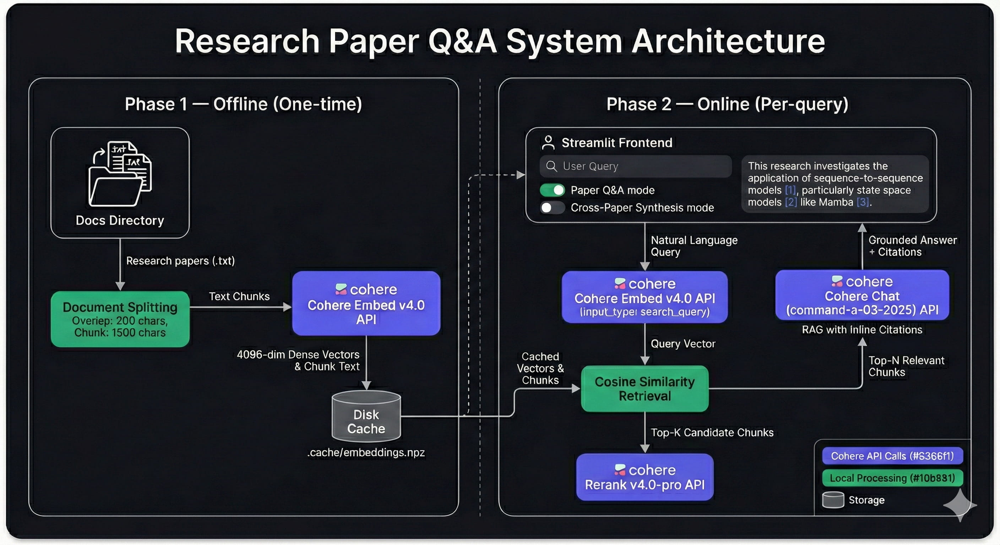

# Research Paper Q&A

Interactive RAG-powered Q&A over my published research, built with [Cohere's](https://cohere.com/) retrieval stack. Ask questions about individual papers or synthesize themes across my body of work — all grounded with inline citations.

### 🚀 [Try it live!](https://mbrotos-cohere-explore.streamlit.app/)


## Stack

| Stage | Model | Role |
|-------|-------|------|
| **Embed** | `embed-v4.0` | Dense vector representations of paper chunks |
| **Rerank** | `rerank-v4.0-pro` | Precision re-ordering of retrieval candidates |
| **Chat** | `command-a-03-2025` | Grounded answers with inline citations via RAG |

### How it works



1. Research papers are split into overlapping text chunks and embedded once (cached to disk).
2. At query time, the question is embedded and matched against chunks via cosine similarity.
3. Top candidates are reranked for precision, then passed as RAG documents to Cohere Chat.
4. The model answers using only the retrieved context, with citations pointing back to specific papers.

### Modes

- **📖 Paper Q&A** — Ask any question. Relevant passages are retrieved, reranked, and used as context for a grounded, cited answer.
- **🔗 Cross-Paper Synthesis** — Select 2+ papers and discover shared themes, contrasting methods, and overarching narratives. Chunks are retrieved from each paper for balanced cross-document reasoning.

## Papers

| Paper | Year | Link |
|-------|------|------|
| Spectral Mapping of Singing Voices: U-Net-Assisted Vocal Segmentation | 2024 | [arXiv](https://arxiv.org/abs/2405.20059) |
| On Using Quasirandom Sequences in ML for Model Weight Initialization | 2024 | [arXiv](https://arxiv.org/abs/2408.02654) |
| Lock Prediction for Zero-Downtime Database Encryption | 2025 | [arXiv](https://arxiv.org/abs/2506.23985) |
| On Sequence-to-Sequence Models for Automated Log Parsing | 2026 | [arXiv](https://arxiv.org/abs/2602.07698) |

## Run locally

### Prerequisites

- Python 3.13+
- [uv](https://docs.astral.sh/uv/) package manager
- A [Cohere API key](https://dashboard.cohere.com/api-keys) (free trial works)

### Quickstart

```bash
git clone https://github.com/mbrotos/cohere-explore.git
cd cohere-explore

# Install dependencies
uv sync

# Add your API key
cp .env.example .env
# Edit .env and set CO_API_KEY=your_key_here

# Run the app
uv run streamlit run app.py
```

The app opens at `http://localhost:8501`. On first launch, document chunks are embedded via the Cohere API (~3-4 min on a trial key due to rate limits). Embeddings are cached to `.cache/` — subsequent launches are instant.

### Hello World

A standalone script to verify your Cohere setup:

```bash
uv run python helloworld.py
```

## Deployment

Deployed via [Streamlit Community Cloud](https://share.streamlit.io) with auto-deploy on push to `main`. The `CO_API_KEY` is stored in Streamlit secrets.
